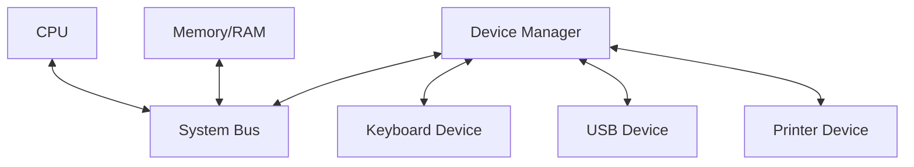

# 8085 Microprocessor Emulator

A high-fidelity, cycle-accurate 8085 microprocessor emulator built in Python. This simulator models the internal CPU registers, flag registers, system bus control lines, memory space, T-states, machine cycles, peripheral hardware devices, hardware and software interrupts, and direct memory access (DMA) transfers.

---

## Table of Contents
1. [Key Features](#key-features)
2. [Architecture Overview](#architecture-overview)
3. [Instruction Set Support](#instruction-set-support)
4. [Interrupt System](#interrupt-system)
5. [Direct Memory Access (DMA) & Control Lines](#direct-memory-access-dma--control-lines)
6. [Peripheral Devices](#peripheral-devices)
7. [Running the Test Suite](#running-the-test-suite)
8. [Code Structure](#code-structure)

---

## Key Features
- **T-State Accuracy:** Simulates execution cycle-by-cycle and state-by-state, matching the actual 8085 hardware timing.
- **Interrupt Controller:** Full support for non-maskable (`TRAP`) and maskable hardware interrupts (`RST 7.5`, `RST 6.5`, `RST 5.5`, `INTR` via `INTA` acknowledge cycle), as well as software restarts (`RST 0` through `RST 7`).
- **DMA Support:** Models standard `HOLD`/`HLDA` handshaking for direct bus takeover by high-speed peripherals.
- **Peripheral Architecture:** Extensible I/O address mapping with support for status and data registers.
- **Comprehensive Instruction Set:** Fully implements 8085 data transfer, logic, arithmetic, stack, branching, and control instructions.
- **Label Referencing:** Supports defining labels (e.g. `label="LOOP"`) at any instruction and referencing them indirectly (e.g. `"LOOP"`) in branching/jumps (`JMP`, `CALL`, conditional jumps/calls) and register initialization (`LXI`), resolved via a double-pass compiler.

---

## Architecture Overview



### 1. CPU Registers
The CPU contains:
- **Accumulator (Register A)** and 8-bit registers **B, C, D, E, H, L**.
- **Program Counter (PC)** and **Stack Pointer (SP)** (16-bit registers).
- **Flag Register** (Sign, Zero, Auxiliary Carry, Parity, Carry).
- Hidden **W and Z** registers for internal operations.

### 2. System Bus
The `SystemBus` contains:
- Address lines ($A_0 - A_{15}$).
- Data lines ($D_0 - D_7$).
- Control lines: Memory Read (`MR`), Memory Write (`MW`), I/O Read (`IOR`), I/O Write (`IOW`).
- Interrupt and DMA lines: `INTA`, `HOLD`, `HLDA`, `READY`, `RESET_IN`, `RESET_OUT`.

---

## Instruction Set Support

The emulator supports the complete standard instruction set, categorized below:

### Data Transfer
- `MOV r1, r2` / `MOV r, M` / `MOV M, r`
- `MVI r, data` / `MVI M, data`
- `LXI rp, data16`
- `LDA addr` / `STA addr`
- `LDAX rp` / `STAX rp`
- `LHLD addr` / `SHLD addr`
- `XCHG`

### Arithmetic & Logical
- `ADD r` / `ADD M` / `ADI data` / `ADC r` / `ADC M` / `ACI data`
- `SUB r` / `SUB M` / `SUI data` / `SBB r` / `SBB M` / `SBI data`
- `INR r` / `INR M` / `DCR r` / `DCR M`
- `INX rp` / `DCX rp` / `DAD rp`
- `ANA r` / `ANA M` / `ANI data` / `ORA r` / `ORA M` / `ORI data` / `XRA r` / `XRA M` / `XRI data`
- `CMP r` / `CMP M` / `CPI data`
- `DAA` / `CMA` / `STC` / `CMC`
- `RLC` / `RRC` / `RAL` / `RAR`

### Stack & Subroutines
- `PUSH rp` / `PUSH PSW` / `POP rp` / `POP PSW`
- `XTHL` / `SPHL`
- `CALL addr` / `RET`
- Conditional Calls & Returns: `CZ`, `CNZ`, `CC`, `CNC`, `CP`, `CM`, `CPE`, `CPO`, `RZ`, `RNZ`, `RC`, `RNC`, `RP`, `RM`, `RPE`, `RPO`

### Branching & Jumps
- `JMP addr` / `PCHL`
- Conditional Jumps: `JZ`, `JNZ`, `JC`, `JNC`, `JP`, `JM`, `JPE`, `JPO`
- Restart Instructions: `RST 0` through `RST 7`

### Machine & I/O Control
- `IN port` / `OUT port`
- `EI` (Enable Interrupts) / `DI` (Disable Interrupts)
- `RIM` (Read Interrupt Mask) / `SIM` (Set Interrupt Mask)
- `NOP` / `HLT`

---

## Interrupt System

The emulator implements precise hardware and software interrupts:

1. **TRAP (Non-Maskable):** Highest priority. Vectors directly to `0x0024`.
2. **RST 7.5 (Edge-Triggered):** Second highest priority. Maskable via `SIM`. Vectors to `0x003C`.
3. **RST 6.5 (Level-Triggered):** Third highest priority. Maskable via `SIM`. Vectors to `0x0034`.
4. **RST 5.5 (Level-Triggered):** Fourth highest priority. Maskable via `SIM`. Vectors to `0x002C`.
5. **INTR (Level-Triggered):** Lowest priority. Maskable via `DI`/`EI`. Initiates an `INTA` acknowledge cycle to fetch a restart opcode (`0xC7` - `0xFF`) from an external peripheral.
6. **Software Restarts (`RST 0` - `RST 7`):** Execution of restart instructions vectors control flow to $(8 \times n)$ memory locations (`0x0000` - `0x0038`).

---

## Direct Memory Access (DMA) & Control Lines

- **HOLD & HLDA:** High-speed peripherals pull `HOLD = 1` on the system bus. On the next T-state, the CPU relinquishes control, drives tri-state lines low, and asserts `HLDA = 1`. The peripheral can then read or write memory directly.
- **READY Wait States:** If a peripheral drives `READY = 0`, the CPU enters wait states, halting execution until `READY = 1`.
- **Hardware Reset:** Asserting `RESET_IN = 1` clears the program counter (`PC = 0x0000`), disables interrupts (`inte = False`), and asserts `RESET_OUT = 1`.

---

## Peripheral Devices

Peripherals are mapped using `DeviceManager` and connected via I/O ports.

### Keyboard Device (`KeyboardDevice`)
- Captures ASCII key inputs (`0 - 127`).
- Emits interrupt vectors during `INTA` cycles.
- Accessible via read ports.

### USB Device (`USBDevice`)
- Simulates high-speed data transfer.
- Performs DMA memory reads and writes directly to/from system memory utilizing the `HOLD`/`HLDA` pins.

### Printer Device (`PrinterDevice`)
- Prints output character streams to a custom callback function or stdout.
- Records data transfer history.

---

## Example Program (Hello World)

Below is an example of writing, loading, and executing a simple 8085 assembly program that outputs `"Hello, World!"` to the `PrinterDevice`:

```python
from main import *

# 1. Create a printer device with a custom callback
printer = PrinterDevice(output_callback=lambda char: print(char, end=""))

# 2. Attach printer to Port 0x02
machine = Machine.create(
    address_lines=16,
    data_lines=8,
    devices=[(printer, [0x02])]
)

# 3. Define the assembly program
program = Program([
    Instruction(Opcode.LXI_H, Mem(0x0100)), # HL points to 0x0100
    Instruction(Opcode.MOV_A_M),                 # Load [HL] to A
    Instruction(Opcode.CPI, Data.byte(0x00)),# Compare A with 0x00
    Instruction(Opcode.JZ, Mem(0x0013)),    # Jump to HLT if Zero
    Instruction(Opcode.OUT, Data.byte(0x02)),# Write A to printer
    Instruction(Opcode.INX_H),                   # HL++
    Instruction(Opcode.JMP, Mem(0x0003)),    # Loop back
    Instruction(Opcode.HLT)                      # Halt
])

# 4. Load program at address 0x0000
machine.load(program, Mem(0x0000))

# 5. Load string "Hello, World!\n\x00" at address 0x0100
message = b"Hello, World!\n"
for i, val in enumerate(message):
    machine.ram.write(Mem(0x0100 + i), Data.byte(val))
machine.ram.write(Mem(0x0100 + len(message)), Data.byte(0x00))

# 6. Run the machine
machine.run()
```

### Hello World with Instruction Labels
Below is the same program rewritten to use the **Label Referencing** feature, eliminating the need to calculate absolute instruction offsets manually:

```python
from main import *

printer = PrinterDevice(output_callback=lambda char: print(char, end=""))

machine = Machine.create(
    address_lines=16,
    data_lines=8,
    devices=[(printer, [0x02])]
)

# Define the assembly program using label string references
program = Program([
    Instruction(Opcode.LXI, "STR_DATA"),          # HL points to STR_DATA label
    Instruction(Opcode.MOV_A_M, label="LOOP"),    # LOOP label at start of fetch
    Instruction(Opcode.CPI, Data.byte(0x00)),
    Instruction(Opcode.JZ, "EXIT"),               # Branch to EXIT label if null
    Instruction(Opcode.OUT, Data.byte(0x02)),
    Instruction(Opcode.INX_HL),
    Instruction(Opcode.JMP, "LOOP"),              # Jump back to LOOP
    Instruction(Opcode.HLT, label="EXIT"),        # EXIT label halts execution
    Instruction(Opcode.NOP, label="STR_DATA")     # Data block pointer
])

machine.load(program, Mem(0x0000))

# Load string Hello, World! at resolved memory location of STR_DATA (0x0010)
str_addr = Mem(0x0010)
message = b"Hello, World!\n"
for i, val in enumerate(message):
    machine.ram.write(Mem(str_addr + i), Data.byte(val))
machine.ram.write(Mem(str_addr + len(message)), Data.byte(0x00))

machine.run()
```

---

## Runnable Examples

The `examples/` directory contains complete, runnable demonstrations of various hardware and software capabilities:
- **`data_transfer.py`:** Register transfer, immediate load, indirect and direct load/store.
- **`arithmetic_immediate.py`:** Immediate arithmetic instructions (`ADI`, `ACI`, `SUI`, `SBI`).
- **`arithmetic_register.py`:** Register and memory arithmetic instructions (`ADD`, `ADC`, `SUB`, `SBB`, `INR`, `DCR`).
- **`logical_operations.py`:** Bitwise logical and comparison instructions (`ANA`, `ANI`, `ORA`, `ORI`, `XRA`, `XRI`, `CMP`, `CPI`, `CMA`).
- **`branching_control.py`:** Call, return, unconditional and conditional jumps.
- **`register_pair_arithmetic.py`:** 16-bit register pair modifications (`INX`, `DCX`, `DAD`).
- **`stack_operations.py`:** Stack instructions (`PUSH`, `POP`, `XTHL`, `SPHL`).
- **`keyboard_input_interrupt.py`:** Reading user input via I/O port and handling interrupts via ISR.
- **`usb_dma_transfer.py`:** USB device directly transferring memory using the DMA bus takeover protocol.
- **`printer_output.py`:** Writing character streams out to custom printer callback functions.
- **`system_control_pins.py`:** Simulating hardware reset (`RESET_IN`/`RESET_OUT`) and wait state insertion (`READY`).
- **`bcd_arithmetic.py`:** BCD addition and decimal adjust accumulator (`DAA`).
- **`hello_world_labels.py`:** Outputs string to printer device using label references.
- **`loop_multiplication_labels.py`:** Multiplies register B by C via addition loop controlled by label branch.

To run any example:
```bash
uv run examples/data_transfer.py
```

---

## Code Structure

- **`main.py`:** Holds CPU emulation logic, dispatch matrices, memory, bus structures, and peripheral devices.
- **`tests.py`:** Contains unit test classes validating execution logic, DMA control, peripherals, and interrupt handling.
