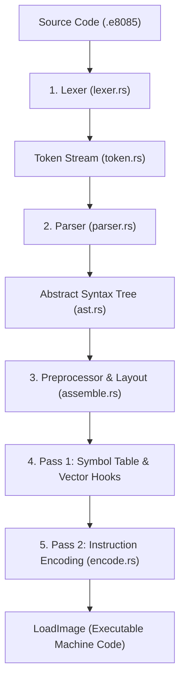

# 8085 Assembler Architecture & Toolchain

The `emu8085` built-in assembler is a modular, two-pass assembler and preprocessor designed specifically for the Intel 8085 microprocessor. It transforms `.e8085` and `.asm` source text into a ready-to-execute machine image ([`LoadImage`](../src/asm/assemble.rs)) complete with interrupt vector table setup, segment memory layout, symbol resolution, and instruction encoding.

---

## 1. Pipeline Architecture

The assembly pipeline processes source code through sequential stages:



---

## 2. Pipeline Stages in Detail

### Stage 1: Lexical Analysis (`src/asm/lexer.rs`, `src/asm/token.rs`)
The lexer scans the raw UTF-8 source string into a stream of tokens, tracking line and column spans for error reporting.

- **Directives**: `%define`, `%repeat`, `%len`.
- **Segments**: `segment`, `.data`, `.bss`, `.text`.
- **Data Sizes**: `BYTE`, `WORD`.
- **Numeric Literals**:
  - Hexadecimal: `0x12`, `0XABCD`
  - Binary: `0b1010_0101`, `0B1111`
  - Octal: `0o77`, `0O123`
  - Decimal: `42`, `1000`
- **String and Character Literals**: `"Hello 8085!\n"`, `'A'`.
- **Registers & Keywords**: `A`, `B`, `C`, `D`, `E`, `H`, `L`, `M`, `BC`, `DE`, `HL`, `SP`, `PSW`.
- **Comments**: Semicolon (`;`) to end of line.

### Stage 2: Parsing & AST Construction (`src/asm/parser.rs`, `src/asm/ast.rs`)
The recursive-descent parser constructs an Abstract Syntax Tree ([`Program`](../src/asm/ast.rs)) representing:
- **Global Directives**: `%define` constants.
- **Data Declarations**: Initialized `BYTE` / `WORD` items with optional `%repeat` expressions.
- **BSS Reservations**: Uninitialized `BYTE` / `WORD` reservation counts.
- **Text Items**: Label definitions and instructions with parsed operands (registers, immediate values, symbol references, or `%len` queries).

### Stage 3: Preprocessor & Constant Resolution
Before layout, the assembler resolves preprocessor constants:
- Substitutes `%define` constants into immediate operands and repeat counts.
- Supports **define chaining** (a `%define` referencing an earlier `%define`).
- Evaluates `%len <var>` to the exact byte count of a previously defined data array or BSS reservation.

### Stage 4: Memory Layout & Vector Table Generation
The 8085 architecture reserves the first 64 bytes (`0x0000`..`0x003F`) for hardware reset and interrupt vectors. The assembler automatically builds this memory layout:

```text
+------------------+ 0x0000  Reset / Bootstrap (JMP main)
|  Vector Table    | 0x0008  RST 1 Vector (JMP isr_rst1)
|  (64 Bytes)      | 0x0010  RST 2 Vector (JMP isr_rst2)
|                  | 0x0024  TRAP Vector  (JMP isr_trap)
|                  | 0x0038  RST 7 Vector (JMP isr_rst7)
+------------------+ 0x0040  DATA_BASE
|  .data segment   | Initialized constants & string literals
+------------------+
|  .bss segment    | Zero-initialized buffer reservations
+------------------+
|  .text segment   | Executable code & ISR subroutines
+------------------+
```

#### Automatic Vector Hooking
When user source code defines any recognized ISR label names, the assembler automatically writes a 3-byte `JMP <isr_address>` (`0xC3 <low> <high>`) directly into the corresponding vector slot:

| Vector Address | Hardware / Software Source | Recognized ISR Labels |
|:---:|:---|:---|
| `0x0000` | Reset / RST 0 | Entry point (`main:`) |
| `0x0008` | Software `RST 1` | `isr_rst1`, `rst1_isr`, `isr_rst_1` |
| `0x0010` | Software `RST 2` | `isr_rst2`, `rst2_isr`, `isr_rst_2` |
| `0x0018` | Software `RST 3` | `isr_rst3`, `rst3_isr`, `isr_rst_3` |
| `0x0020` | Software `RST 4` | `isr_rst4`, `rst4_isr`, `isr_rst_4` |
| `0x0024` | Non-Maskable `TRAP` | `isr_trap`, `trap_isr`, `isr_trap_handler` |
| `0x0028` | Software `RST 5` | `isr_rst5`, `rst5_isr`, `isr_rst_5` |
| `0x002C` | Hardware `RST 5.5` | `isr_rst55`, `rst55_isr`, `isr_rst_5_5` |
| `0x0030` | Software `RST 6` | `isr_rst6`, `rst6_isr`, `isr_rst_6` |
| `0x0034` | Hardware `RST 6.5` | `isr_rst65`, `rst65_isr`, `isr_rst_6_5` |
| `0x0038` | Software `RST 7` | `isr_rst7`, `rst7_isr`, `isr_rst_7` |
| `0x003C` | Hardware `RST 7.5` | `isr_rst75`, `rst75_isr`, `isr_rst_7_5` |

### Stage 5: Pass 1 — Symbol Table Generation
The assembler traverses all segments to compute absolute addresses:
1. `.data` variables are placed starting at `0x0040`.
2. `.bss` variables are placed immediately following `.data`.
3. `.text` labels are placed starting after `.bss`.
4. All variable and label names are recorded in the symbol table (`BTreeMap<String, u16>`).

### Stage 6: Pass 2 — Instruction Encoding (`src/asm/encode.rs`)
The encoder maps each instruction mnemonic and resolved operand into its 1-, 2-, or 3-byte machine code sequence:
- **1-byte instructions** (e.g. `MOV A, B` → `0x78`, `HLT` → `0x76`, `RET` → `0xC9`).
- **2-byte instructions** (e.g. `MVI A, 0x55` → `0x3E 0x55`, `IN 0x01` → `0xDB 0x01`).
- **3-byte instructions** (e.g. `LXI HL, 0x1234` → `0x21 0x34 0x12`, `JMP label` → `0xC3 <lo> <hi>`).
- Emits 16-bit address and word immediates in **Little-Endian** byte order.

---

## 3. Output Formats

### `LoadImage`
The final product of `emu8085::asm::assemble(src)` is a [`LoadImage`](../src/asm/assemble.rs):
```rust
pub struct LoadImage {
    pub bytes: Vec<u8>,    // Contiguous memory image starting at 0x0000
    pub entry: u16,        // Entry point address (address of main:)
    pub sp_init: u16,      // Initial stack pointer (default 0xFFFF)
}
```

### Source Listing (`ListingRow`)
Produced via `emu8085::asm::assemble_listing(src)` to generate interleaved debugging listings:
```rust
pub struct ListingRow {
    pub addr: u16,          // Memory address
    pub bytes: Vec<u8>,     // Machine code bytes generated for this row
    pub source: String,     // Original source text
}
```

---

## 4. Unified CLI Tooling (`e8085`)

The `e8085` CLI provides three core subcommands for compiling, running, and disassembling 8085 programs:

### 1. Compile to Binary Image (`compile`)
Assembles a `.e8085` source file and writes a raw binary machine code image (`.8085.bin`):
```bash
cargo run --bin e8085 -- compile programs/hello_world.e8085 -o target/hello_world.8085.bin
```
**Output**:
```text
Compiled 'programs/hello_world.e8085' -> 'target/hello_world.8085.bin' (103 bytes)
```

### 2. Run Program or Binary Image (`run`)
Executes either an assembly source file (`.e8085`) or a precompiled binary image (`.8085.bin`) on the cycle-accurate emulator with virtual terminal I/O:
```bash
# Run assembly file
cargo run --bin e8085 -- run programs/hello_world.e8085

# Run precompiled binary file
cargo run --bin e8085 -- run target/hello_world.8085.bin
```

### 3. Disassemble Binary Image (`disassemble`)
Decodes a `.8085.bin` container into clean assembly instructions from strictly the `.text` segment, annotating instructions with exported global symbols and entry point:
```bash
# Standard output
cargo run --bin e8085 -- disassemble greet.8085.bin

# ANSI colored output
cargo run --bin e8085 -- disassemble greet.8085.bin --color
```
**Output**:
```text
0040: 3E 00            MVI A, 0x00          ; <print>
0042: D3 02            OUT 0x02
...
0054: 3E 02            MVI A, 0x02          ; <input>
...
0071: 4F               MOV C, A             ; <putch>
...
0082: 3E 0A            MVI A, 0x0A          ; <endl>
0084: C3 71 00         JMP 0x0071
0087: 21 AB 00         LXI HL, 0x00AB       ; <main>
...
00AA: 76               HLT
```

### 4. Inspect Binary Container (`inspect` & `strings`)
Analyzes container header metadata, calculates segment memory boundaries/file offsets, lists exported symbol tables, and extracts printable strings:

```bash
# Display full diagnostic report (default --all)
cargo run --bin e8085 -- inspect greet.8085.bin

# Inspect specific sections
cargo run --bin e8085 -- inspect greet.8085.bin --header
cargo run --bin e8085 -- inspect greet.8085.bin --segments
cargo run --bin e8085 -- inspect greet.8085.bin --symbols
cargo run --bin e8085 -- inspect greet.8085.bin --strings

# Extract printable strings with custom minimum length
cargo run --bin e8085 -- strings greet.8085.bin -n 4
```

---

## 5. `.8085.bin` Binary Container Specification

To avoid ambiguous segment boundaries and misinterpreting data bytes as instructions, `.8085.bin` files are packaged with a self-describing 32-byte header followed by contiguous section payloads.

### 1. 32-Byte Header Layout

```text
Offset   Size   Field        Type       Description
-------------------------------------------------------------------------------
0x00     4 B    magic        [u8; 4]    ASCII identifier b"8085"
0x04     1 B    version      u8         Container format version (0x01)
0x05     1 B    flags        u8         Bit 0: FLAG_HAS_VEC_TABLE (0x01)
0x06     2 B    entry_pc     u16 (LE)   Program Entry Point address (main:)
0x08     2 B    sp_init      u16 (LE)   Initial Stack Pointer (0xFFFF)

0x0A     2 B    text_addr    u16 (LE)   RAM load address where .text begins
0x0C     2 B    text_size    u16 (LE)   Byte length of .text payload

0x0E     2 B    data_addr    u16 (LE)   RAM load address where .data begins
0x10     2 B    data_size    u16 (LE)   Byte length of .data payload

0x12     2 B    bss_addr     u16 (LE)   RAM load address where .bss begins
0x14     2 B    bss_size     u16 (LE)   Byte length of .bss reservation (zero-filled)

0x16     2 B    vec_size     u16 (LE)   Byte length of Vector Table payload (64 bytes)
0x18     2 B    sym_size     u16 (LE)   Byte length of Export Symbol Table payload
0x1A     6 B    reserved     [u8; 6]    Reserved for future extensions
-------------------------------------------------------------------------------
```

### 2. Payload Structure (Offsets 0x20 onward)

The header is immediately followed by the section payloads in order:
1. **Vector Table Payload** (`vec_size` bytes, if `FLAG_HAS_VEC_TABLE` is set):
   - Contains the 64-byte interrupt vector table (`0x0000`..`0x003F`) populated with `JMP main` and ISR hooks.
2. **Data Payload** (`data_size` bytes):
   - Initialized variables, string constants, and byte/word arrays loaded at `data_addr`.
3. **Text Payload** (`text_size` bytes):
   - Compiled 8085 CPU machine code instructions loaded at `text_addr`.
4. **Export Symbol Table Payload** (`sym_size` bytes, if `FLAG_HAS_EXPORT_SYMS` is set):
   - Exported `(symbol_name, address)` pairs formatted as `[name_len: u8, name_bytes: [u8], addr: u16 (LE)]`.

---

## 6. Modular Assembly & Scoping

The assembler supports modular development across multiple files and subroutines:

### 1. `global` / `export` Keywords
Marks a label or variable as accessible from other modules and records it in the `.8085.bin` Export Symbol Table:
```assembly
segment .text

; Inline global declaration
global print:
    mvi A, 0x00
    out 0x02
    ret

; Or separate declaration
global helper
helper:
    ret
```
> **Note:** By default, all labels (and `main:`) are **private/local** to the defining module and cannot be accessed externally unless declared `global`.

### 2. `extern` Keyword
Declares external symbols that will be resolved at link time (via `%include`, linked source files, or precompiled `.8085.bin` libraries):
```assembly
segment .text

extern print
extern input

main:
    call print
    hlt
```

### 3. Local Labels (`.name:`, `jz .name`)
Subroutine-scoped local labels prefixed with `.` prevent naming collisions between helper routines:
```assembly
segment .text

strlen:
    mvi B, 0
.loop:
    mov A, M
    cpi 0
    jz .exit
    inx HL
    inr B
    jmp .loop
.exit:
    ret

strcpy:
.loop:
    ; This .loop is distinct to strcpy and never conflicts with strlen.loop
    mov A, M
    stax DE
    inx HL
    inx DE
    jmp .loop
```

### 4. `%include` Directive
Imports `%define` constants, `global` routines, and data declarations from external files:
```assembly
%include "terminal.e8085"

segment .data
    greeting "Hello, " 0x0A

segment .text
main:
    lxi HL, greeting
    mvi B, %len greeting
    call print
    hlt
```
- Includes are resolved relative to the including file's directory.
- Features circular include protection (idempotent inclusion).

---

## 7. Multi-File Compilation & Static Library Linking (`-l`)

### Compiling and Linking Libraries
The linker (`-l / --link`) strictly accepts compiled `*.8085.bin` binary libraries to statically bundle them into a standalone executable:

```bash
# 1. Compile reusable subroutine library (terminal helper)
cargo run --bin e8085 -- compile programs/terminal.e8085 -o terminal.8085.bin

# 2. Compile main program linking with precompiled library (statically bundles library code)
cargo run --bin e8085 -- compile programs/greet.e8085 -l terminal.8085.bin -o greet.8085.bin

# 3. Run the standalone binary executable directly (no runtime -l needed!)
cargo run --bin e8085 -- run greet.8085.bin

# 4. Or run the source file directly with on-the-fly linking
cargo run --bin e8085 -- run programs/greet.e8085 -l terminal.8085.bin
```

> **Note on Entry Points**: Pure subroutine libraries (without a `main:` label) have `entry_pc = 0x0000`. Attempting to run a library binary directly (`e8085 run terminal.8085.bin`) will be rejected with `error: no entry point specified (main label missing in binary)`.