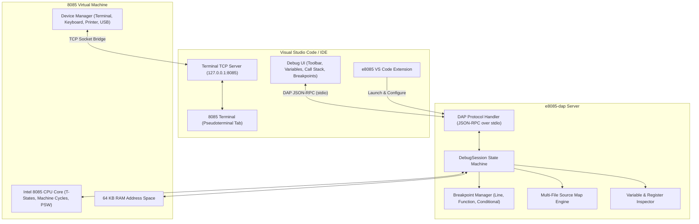

# Debug Adapter Protocol (`e8085-dap`) Documentation

The `e8085-dap` is a high-performance Debug Adapter implementing the [Debug Adapter Protocol (DAP 1.51+)](https://microsoft.github.io/debug-adapter-protocol/) for Intel 8085 microprocessor assembly programs (`.e8085`).

It enables rich, source-level graphical debugging inside modern editors like Visual Studio Code, Neovim, and Emacs, featuring multi-file stepping, conditional breakpoints, live register/flag/memory inspection and mutation, an interactive virtual terminal, live disassembly, and clean halt lifecycle handling.

---

## 1. Architecture Overview



### Communication Channels:
1. **DAP Protocol Channel (`stdio`)**: Standard input/output carries JSON-RPC DAP requests, responses, and notifications (e.g. `launch`, `stackTrace`, `variables`, `stopped`, `terminated`).
2. **Terminal Bridge Channel (`TCP 127.0.0.1:8085`)**: A dedicated localhost TCP stream bridges bidirectional I/O between the virtual peripheral devices (`TerminalDevice`, `PrinterDevice`) and the VS Code `"8085 Terminal"` tab.

---

## 2. Key Features & Capabilities

### 2.1 Multi-File Source Mapping & Stepping
- **Source-Level Stepping**: Step In (`F11`), Step Over (`F10`), and Step Out (`Shift+F11`) seamlessly track execution across the main file, `%include` header modules, and pre-compiled linked libraries.
- **Accurate Line & Column Mapping**: The Assembler generates an AST-level `SourceMap` that records the origin file path, line number, and column for every single assembled instruction byte.
- **Shadow Call Stack**: Tracks nested subroutine calls (`CALL`, `CZ`, `CNZ`, `CC`, `CNC`...) and returns (`RET`, `RZ`, `RNZ`...), displaying the full caller hierarchy in the Call Stack panel with symbolic subroutine names and return addresses.

### 2.2 Breakpoint Management
- **Line Breakpoints**: Set by clicking the editor margin or pressing `F9`. Breakpoints are automatically resolved and verified to the first instruction byte of the target line.
- **Function Breakpoints**: Break directly on global subroutines or local labels (e.g. `print`, `main`, `.loop`).
- **Conditional Breakpoints**: Break only when a user-defined expression evaluates to `true` (e.g. `A == 0x05`, `flags.Z == 1`, `size > 10`).
- **Hit Count Breakpoints**: Break after a line has been hit a specified number of times (e.g. `>= 5`, `== 10`, `% 2 == 0`).

### 2.3 Comprehensive Variables & Scope Inspection
The Variables panel exposes five specialized scopes:

| Scope | Content & Details |
|---|---|
| **CPU Registers** | Individual 8-bit registers (`A`, `B`, `C`, `D`, `E`, `H`, `L`, `M`), 16-bit register pairs (`BC`, `DE`, `HL`, `SP`), and `PC`. Shows formatted Hex, Decimal, Binary, and ASCII character previews. |
| **Flags** | Individual flag bits (`Sign [S]`, `Zero [Z]`, `Auxiliary Carry [AC]`, `Parity [P]`, `Carry [CY]`) along with the full 8-bit **`Flags Byte (PSW)`** formatted as `0x56 (0b01010110)`. |
| **Data Variables & BSS** | All variables declared in `segment .data` and `segment .bss` with their memory addresses, raw values, string contents, and array allocations. |
| **Hardware Diagnostics** | Real-time VM statistics: elapsed T-states, instructions executed, current machine cycle (`Fetch`, `MemoryRead`, `MemoryWrite`, `IORead`, `IOWrite`), and shadow stack depth. |
| **Peripheral Devices** | Status of attached hardware peripherals (`TerminalDevice`, `PrinterDevice`, `KeyboardDevice`) and their mapped I/O port assignments. |

### 2.4 Live Variable & Register Mutation (`setVariable`)
You can edit any register or memory variable directly in the VS Code Variables panel:
- Double-click the value in the panel and enter a new value (e.g. `0xFF`, `255`, `0b11111111`, `'Z'`).
- The debugger validates and updates the live CPU registers or RAM contents immediately.

### 2.5 Live Disassembly (`disassemble`)
- Inspect raw memory instructions alongside your source code.
- Disassembles live machine bytes at any target memory reference (e.g. `PC`, `0x0000`, `label`) showing instruction hex bytes, mnemonics, and resolved symbol annotations.

### 2.6 Expression Evaluation & REPL Console (`evaluate`)
Use the Debug Console or hover over variables in the editor to evaluate expressions:
- **Arithmetic & Logic**: `A + B`, `HL + 0x10`, `(A & 0x0F) == 0`.
- **Register & Flag References**: `PC`, `SP`, `flags.CY`, `flags.Z`.
- **Memory Inspection**: `[0x00A0]`, `[HL]`.
- **Label Resolution**: `askSize`, `buffer + 2`.
- **REPL Commands**:
  - `:in <text>`: Feeds text to the terminal input queue.
  - `:key <char>`: Presses a key on the virtual keyboard device.

### 2.7 Clean Halt & Termination Lifecycle
- When execution reaches `HLT`, the debugger pauses and indicates `CPU Halted (HLT)`.
- Pressing **Continue** (`F5`) or **Step** after a halt cleanly terminates the debug session, sending standard `exited` (exit code `0`) and `terminated` DAP events to the editor.

---

## 3. Interactive Virtual Terminal Architecture

The 8085 platform includes a length-prefixed two-port virtual terminal (`TerminalDevice`):
- **Command Port (`0x02`)**:
  - `CMD_WRITE (0x00)`: Enters write mode.
  - `CMD_DISPLAY (0x01)`: Emits the buffered text to the terminal output.
  - `CMD_READ (0x02)`: Enters blocking capture mode to read user input.
- **Data Port (`0x01`)**: Transfers the length byte followed by the payload characters.

```mermaid
sequenceDiagram
    autonumber
    actor User
    participant Term as VS Code "8085 Terminal"
    participant TCP as TCP Bridge (127.0.0.1:8085)
    participant DAP as e8085-dap
    participant CPU as 8085 CPU & TerminalDevice

    Note over CPU: call print
    CPU->>DAP: CMD_DISPLAY on port 0x02
    DAP->>TCP: write("Enter size of triangle: ")
    TCP->>Term: display prompt

    Note over CPU: call input
    CPU->>DAP: CMD_READ on port 0x02
    Note over CPU,DAP: CPU pauses waiting for terminal input
    User->>Term: Types "5" + Enter
    Term->>TCP: send "5\n"
    TCP->>DAP: mpsc channel receives "5\n"
    DAP->>CPU: captures "5" into terminal buffer
    Note over CPU: Resumes execution; reads length 1, char '5'

    Note over CPU: call draw
    CPU->>DAP: putch('*') & endl
    DAP->>TCP: write("*****\n****\n***\n**\n*\n")
    TCP->>Term: renders star pattern
```

### Interactive Features:
1. **Automatic Focus**: The `"8085 Terminal"` tab is automatically opened and focused when debugging begins.
2. **Blocking Input**: When `call input` is reached, execution pauses until the user types the input and presses **Enter**. The program cannot skip past input unread.
3. **Keystroke Echoing & Line Editing**: Printable keystrokes are echoed immediately, Backspace (`\b` / `\x7f`) deletes the preceding character on screen and in buffer, and Enter sends `\n`.

---

## 4. Configuration & `launch.json` Reference

To debug an 8085 assembly program in VS Code, create a `.vscode/launch.json` file in your workspace:

### Standard Configuration:
```json
{
  "version": "0.2.0",
  "configurations": [
    {
      "type": "e8085",
      "request": "launch",
      "name": "Debug Current 8085 File",
      "program": "${file}",
      "stopOnEntry": true,
      "console": "integratedTerminal",
      "terminalPort": 8085,
      "internalConsoleOptions": "neverOpen"
    }
  ]
}
```

### Configuration Attributes:

| Property | Type | Default | Description |
|---|---|---|---|
| `program` | `string` | `"${file}"` | Path to the `.e8085` source file or pre-compiled container to debug. |
| `stopOnEntry` | `boolean` | `true` | Automatically pause execution at the entry point instruction (`main:` or `0x0000`). |
| `console` | `string` | `"integratedTerminal"` | Where to connect the interactive terminal: `"integratedTerminal"`, `"internalConsole"`, or `"externalTerminal"`. |
| `terminalPort` | `number` | `8085` | Local TCP port used to bridge the VS Code pseudoterminal with the DAP server. |
| `internalConsoleOptions`| `string` | `"neverOpen"` | Prevents VS Code from switching away from the terminal to the Debug Console on launch. |
| `includePaths` | `string[]` | `[]` | Additional search directories for `%include` file resolution. |
| `linkLibraries` | `string[]` | `[]` | Pre-compiled `.e8085` library containers to link with statically. |

---

## 5. Running the Debug Server

### Standalone Binary
```bash
# Debug adapter running over stdio
cargo run --bin e8085-dap
```

### Unified CLI Subcommand
```bash
# Launch DAP server via e8085 CLI
cargo run --bin e8085 -- dap
```

### In Visual Studio Code
1. Open any `.e8085` assembly file (e.g. `programs/triangle_pattern.e8085`).
2. Press **F5** (or navigate to **Run and Debug** $\to$ **Debug Current 8085 File**).
3. The debug session will start, stop at the entry instruction, and open the `"8085 Terminal"` tab.

---

## 6. End-to-End Debugging Walkthrough

Let's walk through debugging [`programs/triangle_pattern.e8085`](../programs/triangle_pattern.e8085):

```e8085
%include "devices/terminal.e8085"
%include "lib/math.e8085"
%include "lib/conv.e8085"

segment .data
    askSize "Enter size of triangle: "

segment .bss
    buffer BYTE 32
    length BYTE 1
    size BYTE 1

segment .text

main:
    ; Write prompt
    lxi HL, askSize
    mvi B, %Len askSize
    call print

    ; Read input number
    lxi HL, buffer
    mvi B, %len buffer
    call input

    ; Store length of input
    lxi HL, length
    mov M, A
    mov B, A

    ; Convert number to int
    lxi HL, buffer
    call to_uint8

    ; Store the number
    lxi HL, size
    mov M, A

    ; Draw pattern
    call draw

    call endl
    hlt
```

### Step-by-Step Execution:
1. **Launch (F5)**: The debugger halts at line 17 (`lxi HL, askSize`) with `stopOnEntry: true`. The `"8085 Terminal"` tab opens in the bottom panel.
2. **Step Over (`F10`)**: Advances past `lxi HL, askSize` and `mvi B, 24`.
3. **Step Over `call print` (`F10`)**: Subroutine `print` sends `"Enter size of triangle: "` to the terminal. The text appears in the `"8085 Terminal"` tab.
4. **Step Into `call input` (`F11`) or Step Over (`F10`)**: Execution pauses at `call input`, waiting for user input.
5. **Interactive Terminal Input**: In the `"8085 Terminal"` tab, type `4` and press **Enter**.
6. **Execution Continues**: `input` returns length `1` in register `A` and payload `'4'` (0x34) in `buffer`.
7. **Inspect Variables**: Expand the **CPU Registers** and **Data Variables** scopes in the sidebar to verify:
   - `A = 0x01 (1)`
   - `size = 0x04 (4)`
   - `Flags Byte (PSW) = 0x06`
8. **Continue (`F5`)**: `call draw` executes, rendering the triangle pattern in the `"8085 Terminal"`:
   ```text
   ****
   ***
   **
   *
   ```
9. **Halt & Clean Exit**: The program hits `hlt`. Pressing **Continue (`F5`)** cleanly ends the debug session.
